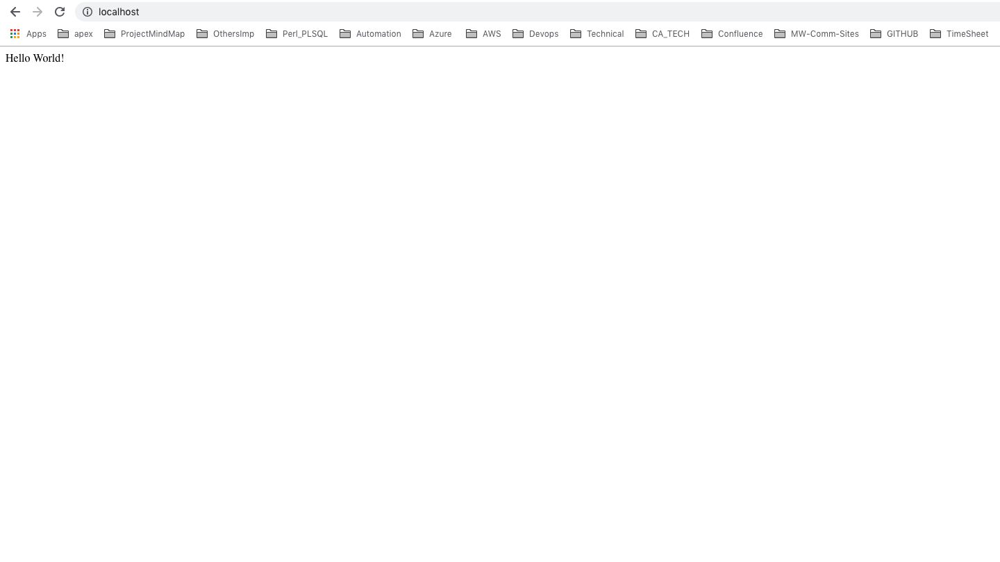
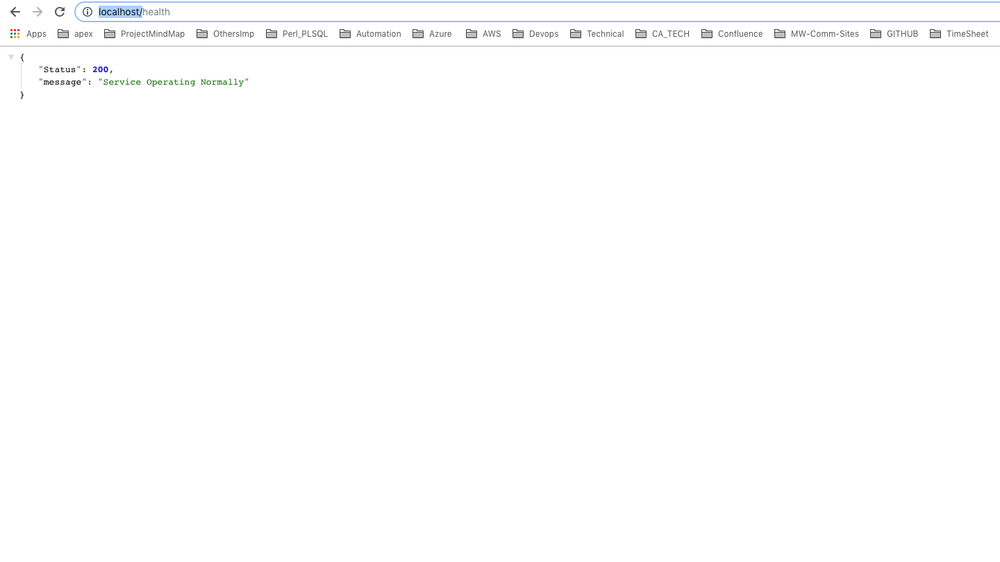
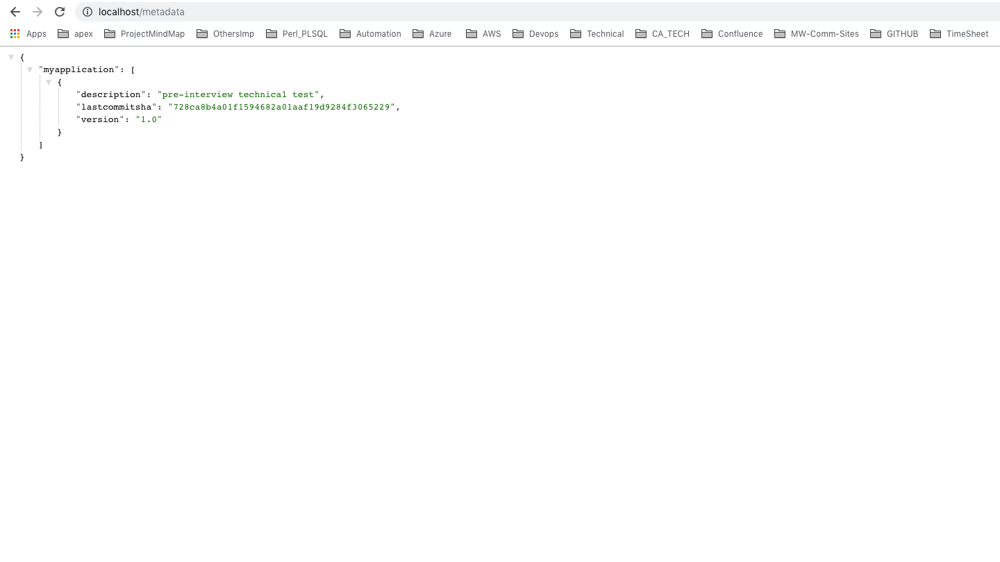

# flaskapp_myob

[](https://travis-ci.org/maheshmarri/flaskapp_myob)

## Contents
- [Intro](#Intro)
- [CI/CD ](#CI/CD)
- [UnitTest](#UnitTest)
- [Depndencies](#Depndencies)
- [Docker Build](#Docker Build)
- [Running Docker](#Running Docker)

# Intro
This is simple flask application based on Python Flask Web framework which utilizes 
the app routes view functions as endpoints.

- App has three endpoints ,default,/health and /metadata
    - /
        - default
    - /health
        - would show status_code and message. 
    
    - /metadata 
        - Would show application metadata,version  and github last commit.  


# CI/CD 
 - Configured Travis as CI/CD Pipeline for each commit on github. 
 - And also app to be built on python version 2.7 and 3.6.
 - For each commit of the 2 parallel builds running for each of the python version.
 - Travis pipeline script also builds docker image and runs the docker container .
 - Runs unittest cases of the application

# UnitTest

 - I have used python unittest framework to develop the unit test cases for the above app to test 
endpoints and its data.

```shell
 python test.py -v
 ```


# Depndencies
 - I have packaged dependencies in requirement.txt file to install dependencies using pip before the app would
executed.


# Docker Build

 - Containerized the flask app into single deployable artifact and its dependencies.

 ```shell 
 docker build -t flaskapp:latest .
 ```

# Running Docker Container

 - The below command would run the docker container which contains flask web application and runs on port 80.

 ```shell
 docker run -d -p 80:80 flaskapp
 ```

 - Once you have executed ,see the running container using below.

 ```shell
 docker ps -a
 ```

# Issues with healh end point -delay loading

 - There is a delay in loading when we browse /health endpoint,becasue of the app is trying to point its own url and returing
the status code . It tries to contact itself to find out the status of the app. 


# App Sreenshots

 

 

 